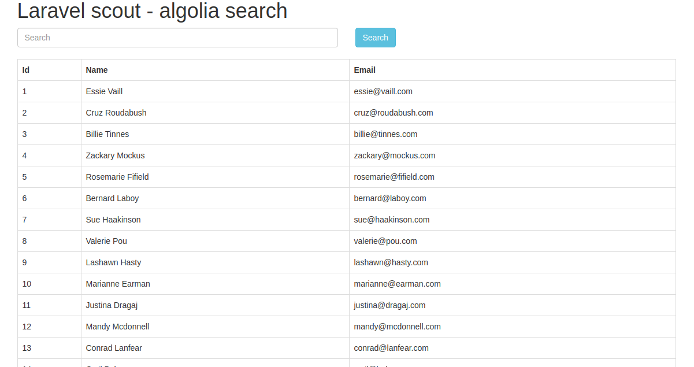
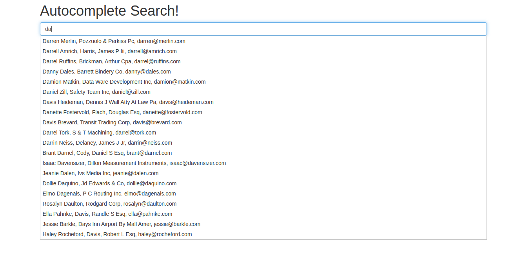
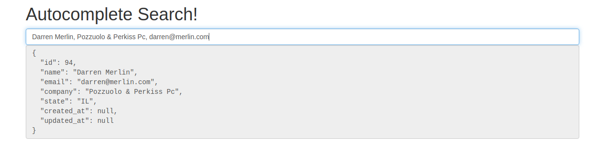

# Algolia scout laravel

## Introduction
Algolia helps businesses across industries quickly create relevant, scalable, and lightning fast Search and Discovery experiences [algolia](https://www.algolia.com/).
This application is show to how to seach data using algolia in laravel
  
## Installation

Please check the official laravel installation guide for server requirements before you start. Official Documentation

Clone the repository

git clone git clone https://github.com/vcian/algolia-scout-laravel

Please check the official laravel installation guide for server requirements before you start. [Official Documentation](https://laravel.com/docs/7.x/installation)

Copy the example env file and make the required configuration changes in the .env file

    cp .env.example .env

Now we need to set configuration queue is true in your env file:

    SCOUT_QUEUE=true
    

Install all the dependencies using composer

    composer install

Generate a new application key

    php artisan key:generate

Ok, now we have to install package for "algolia", so let's run bellow command:
    
    composer require algolia/algoliasearch-client-php
    
Run the database migrations and seeder(**Set the database connection in .env before migrating**)

    php artisan migrate
        
    php artisan db:seed
    
Now we have to set id and secret of algolia, so first you have to create new account in algolia.com. So if you haven't account on algolia.com site then click here and create new account : www.algolia.com

After login we have to get application id and secret so click here and open that web page: www.algolia.com/api-keys GET APP ID and SECRET. After open you will see bellow screen and copy your id and secret.
   
now open your .env file and paste id and secret key like as bellow:

    ALGOLIA_APP_ID=paste app id
    ALGOLIA_SECRET=paste app secret
    
 If you have already added few records on your table then you can index that records by run following command:
 
    php artisan scout:import "App\Contact" 
    
for run the project

     php artisan serve
    
     http:://127.0.0.1::[your_port]/index (datatable search) 
        
     http:://127.0.0.1::[your_port]/search-data (autocomplate search)
        
## Kye points before using this feature

    Please check env file in which you have to define app id and secret key.
    
    Review app/Contact.php file.
    
    Review app/Http/controller/SearchController.php file.
    
## ScreenShots    

## datatable scout - algolia search

## autocomplete algolia search

## Contributing

Please see [CONTRIBUTING](CONTRIBUTING.md) for details.

## Security

If you discover any security-related issues, please email vishal@viitorcloud.com or haresh.sisodiya@viitor.cloud instead of using the issue tracker.

## Credits

- [Haresh Sisodiya](https://github.com/Hareshsinh)

## License

The MIT License (MIT). Please see [License File](LICENSE.md) for more information.
